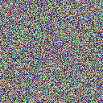

gif-hpp
=====

This one-header library offers a simple, very limited way to create animated GIFs directly in code.
Those looking for particular cleverness are likely to be disappointed; it's pretty much a straight-ahead
implementation of the GIF format with optional Floyd-Steinberg dithering. (It does at least use delta
encoding - only the changed portions of each frame are saved.) 

So resulting files are often quite large. The hope is that it will be handy nonetheless as a quick and easily-integrated way for programs to spit out animations.

Only RGBA8 is currently supported as an input format. (The alpha is ignored.) 

Email me : ctangora@gmail.com


## toolittlecakes:

Added some RAII wrapper around old implementation.

So you need to use only these three classes:
* `GifWriter` - the entity responsible for writing `Frame`s to the file. Allows setting the delay between the `Frame`s.
* `Frame` - 2d matrix of pixels. Supports `[{i, j}]` indexation.
* `Pixel` - a combination of 4 numbers, defining pixel color: RGB + alpha(opacity), which is not supported in the lib, so initialized as 0.

Usage:
-------------------


```cpp
#include "gif.hpp"

#include <cmath>
#include <random>
#include <string>

const int width = 128;
const int height = 128;

int main(int argc, const char *argv[]) {
  const std::string filename{"./output.gif"};

  gif::GifWriter writer{filename, width, height, 10};

  for (int frame_number = 0; frame_number < 20; ++frame_number) {
    // create a new black frame
    gif::Frame frame{width, height};

    // set each pixel as a random color
    for (std::size_t i = 0; i < height; ++i) {
      for (std::size_t j = 0; j < height; ++j) {
        frame[{i, j}] = gif::Pixel{
            static_cast<uint8_t>(rand() % 255),
            static_cast<uint8_t>(rand() % 255),
            static_cast<uint8_t>(rand() % 255),
        };
      }
    }

    // dump frame from memory to the file
    writer.write_frame(frame);
  }

  return 0;
}
```

Code above produces the following gif:


